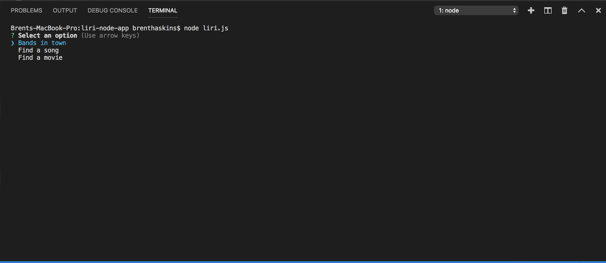
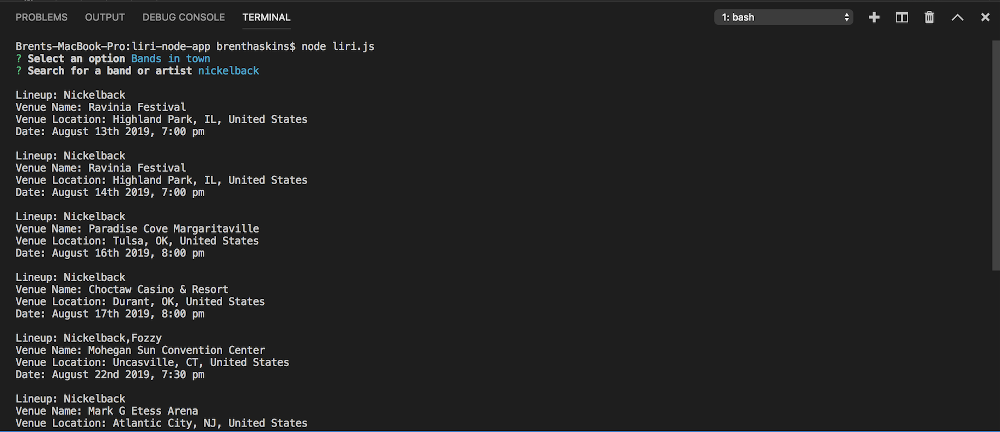
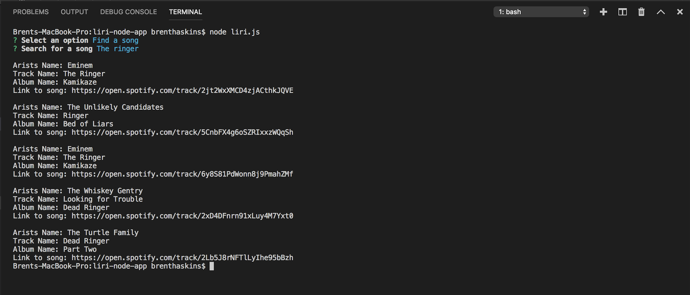
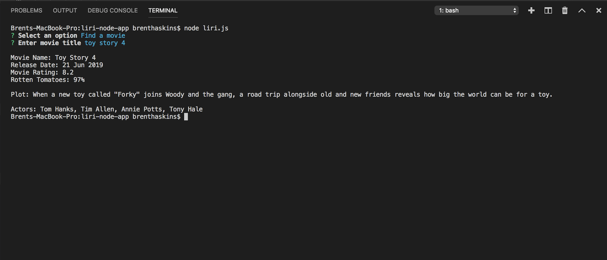

# liri-node-app

LIRI will search Spotify for songs, Bands in Town for concerts, and OMDB for movies.

## Installation

LIRI uses Axios, Inquirer, Node-Spotify-API, Moment

```bash
npm install axios
npm install inquirer
npm install --save node-spotify-api
npm install moment
```

## Examples

Axios & Spotify is used to get information depending on the users search


```javascript
axios.get("https://rest.bandsintown.com/artists/"
spotify.search({ type: 'track', query: songs, limit: 5 }
axios.get("http://www.omdbapi.com/?t="


inquirer
    .prompt([
        {
            type: "list",
            message: "Select an option",
            choices: ["Bands in town", "Find a song", "Find a movie"],
            name: "list"
        }
    ])
```

## Screenshots









## Contributing

Pull requests are welcome!
